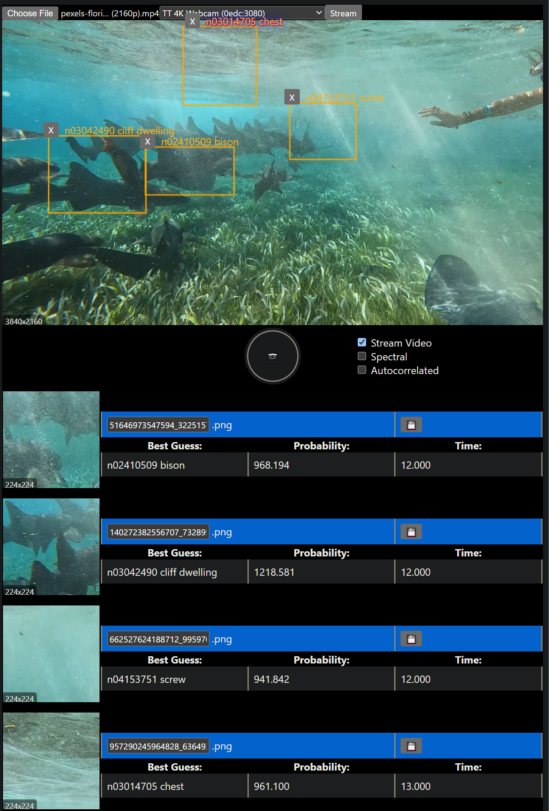

Copy of the official [wonnx wasm](https://github.com/webonnx/wonnx) squeeze net [example](https://github.com/webonnx/wonnx-wasm-example) with a test for multithreading the video codec so I can store recent data in memory and draw image copies to canvases or send to the classifier or do other things. 

It uses the capacitor community CameraPreview API for mobile camera access but the rest is vanilla JS, though the mobile app isn't set up yet with the special permissions and build step requirements. This repo will evolve.

Inference time for the 1000 label squeeze-net averages about 6-10ms for me on an RTX 3070, whatever that means. I tested on a 4K camera but the squeeze net uses only like a small square of the image. Switching over to an MNIST example next.

I'm getting about 120fps-135FPS on just the WONNX pass. It's not actually 120FPS with the full demo because we're rendering a bunch of offscreen canvases same time but it's still fast, and otherwise throttles itself based on worker load. This is also with a 1080p youtube video in another tab. 

# build and run
`npm i -g tinybuild` then `npm start`

Note, these labels don't include the right species:

