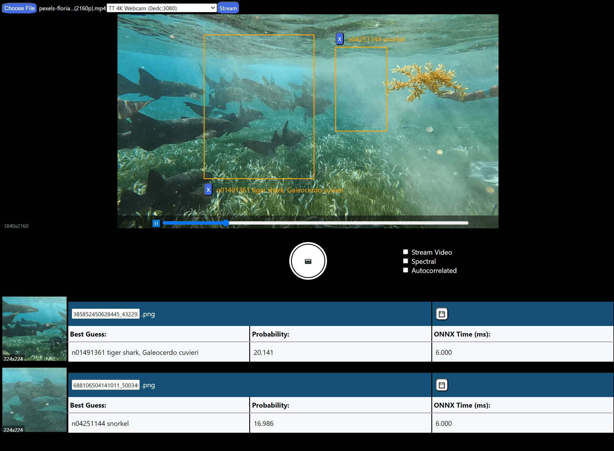

## ONNX Runtime Camera & Bounding Box Real-Time Classification Demo

### [Live Demo](https://wonnx-cameraid.netlify.app/)

Copy of the official [onnxruntime-web](https://github.com/microsoft/onnxruntime) squeeze net [example](https://github.com/webonnx/wonnx-wasm-example) with a test for multithreading the video codec so I can store recent data in memory and draw image copies to canvases or send to the classifier or do other things. 

- Train your own xgboost image or CSV models with simple python notebooks: https://github.com/joshbrew/XGBoost_ONNX_Training_Conversion

### App features
- Frontend uses onnxruntime-web with WebGPU by default with fallback to WebGL or WASM SIMD.
- Multithreaded image/video processing. We need to write our own GPU kernels to speed this up any faster, we're just doing simple VideoFrame and canvas manipulation.
- Capacitor mobile webview app build, the webgpu runtime worked last time we checked. Some of the rendering is bugged. 

### Inference times:

This is exciting for clientside applications:

On mobile WebGL (Galaxy S10e):
- 0.5-1.2ms 4x800 CSV XGBoost (31kb)
- 20-30ms 512x512 Image XGBoost (7.6mb)
- 100ms 244x244 Image squeeze net (4.8mb)

On desktop WebGPU (RTX3070 mobile ed, i7-10750H):
- Sub-millisecond 4x800 XGBoost (31kb)
- ~15ms 512x512 Image XGBoost (7.6mb)
- 4-6ms 244x244 Image squeeze (4.8mb)

# build and run
`npm i -g tinybuild` then `npm start`

Note, these labels don't include the right species:

# Mobile Build

### For android 
with the capacitor dependencies installed and the latest android studio installation:

`tinybuild bundle`

if you modified the workers, copy them into the nested dist folder (placeholder redundancy)

`npx cap sync`

`npx cap open android`

### or for ios

`npx cap add ios`

then 

`tinybuild bundle`

if you modified the workers, copy them into the nested dist folder (placeholder redundancy)

`npx cap sync`

`npx cap open ios`

Note the dist has copies necessary for the mobile build to run e.g. the ./dist/models and ./dist/dist to keep the same relative paths as the webapp. This should be cleaned up for production to prevent bloat for the served app.
